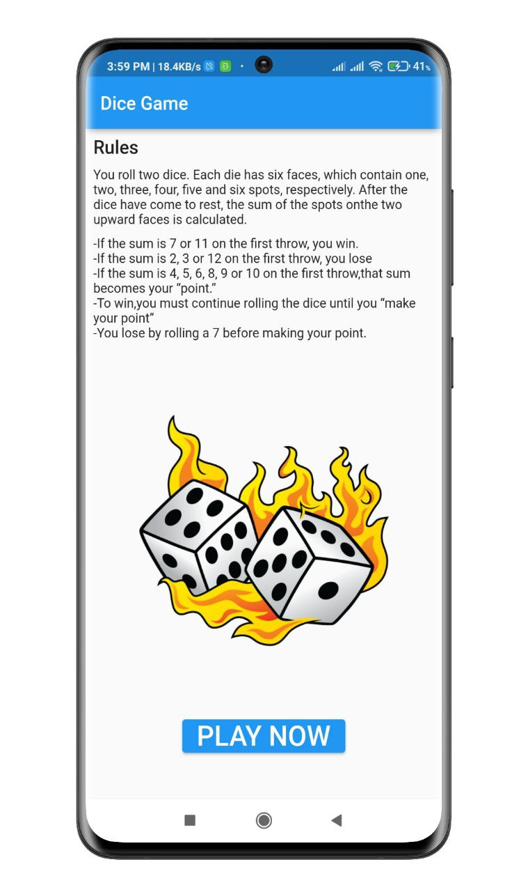

# Dice Game App

This is very simple Game. You have to roll two dice. Each die has six faces, which contain 
one, two, three, four, five and six spots, respectively. After the dice have come to rest, the sum of the spots on the two upward faces is calculated. 

#### *Game Rules*

- If the sum is 7 or 11 on the first throw, you win.  
- If the sum is 2, 3 or 12 on the first throw (called “craps”), you lose (i.e., the “house” wins). 
- If the sum is 4, 5, 6, 8, 9 or 10 on the first throw, that sum becomes your “point.” 
- To win,you must continue rolling the dice until you “make your point”(i.e., roll that samepoint value). 
- You lose by rolling a 7 before making your point.
## Screenshots

<p align="center">
  
  
  
</p>


## Features
- Very user friendly
- Number of win and lose counted


## Setup

Clone the repository

```bash
  git clone https://github.com/muradhossin/dice_game.git
```
Move to the desired folder

```bash
  cd \dice_game.git
```
To run the app, simply write

```bash
  flutter pub get
```
```bash
  flutter run
```
## Tech Stack

**Built With:** Dart, Flutter

**State Management:** Provider


## Platform

- Android


## Contributing

Contributions are always welcome!

See `contributing.md` for ways to get started.

Please adhere to this project's `code of conduct`.


## License

[MIT](https://choosealicense.com/licenses/mit/)


## Support

For support, please contact here [](https://linkedin.com/in/md-murad-hossin)

  💰 You can help me by Donating
  [](https://buymeacoffee.com/muradhossin) 
